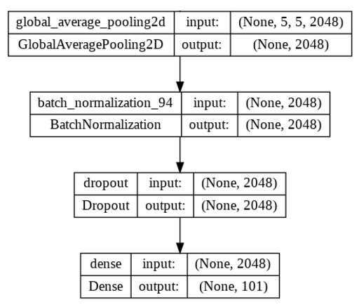
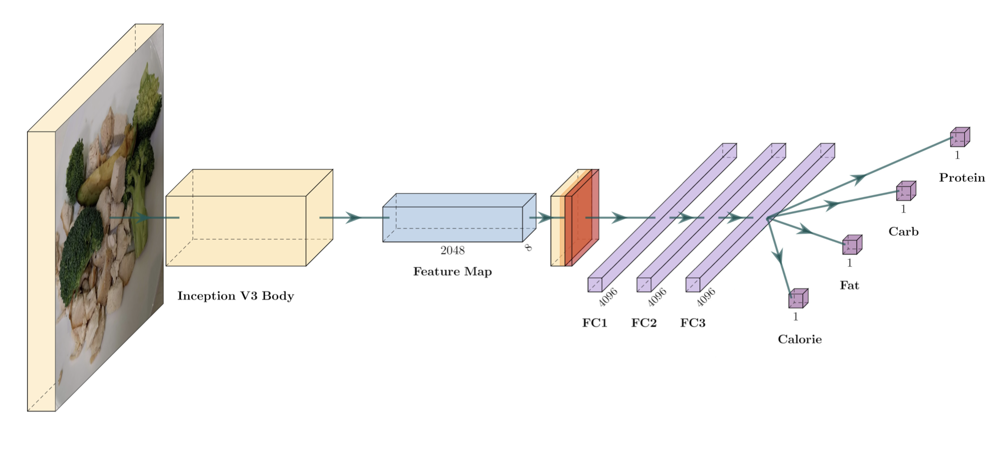

# Image-based food classification and calories estimation
 
 ## Goal
 Build model which can determine the dish and its calories based on photo
 
 ## Dataset
 For training our model we use [Nutrition5k](https://github.com/google-research-datasets/Nutrition5k) and manually collected dataset, where we parse ~60k photos and dishes info from [Яндекс.Еда](https://eda.yandex.ru/)

[Link to shared google drive](https://drive.google.com/drive/folders/16KqOlY0Hnnk4xDJMn3H_NG7aR-TYcE03?usp=share_link)

## Model
Our models is build on top of the [Google Inception-v3](https://paperswithcode.com/method/inception-v3)

### Image Classification
Structure:
- Inception-v3
- Batch Normalization
- Dropout
- FullyConnected Layer + SoftMax Activation


### Calories estimation
Structure:
- Inception-v3
- AveragePooling (3x3 stride-2)
- 2xFullyConnected Layers(4096) + LeakyReLu activations
- 2xFullyConnected Layers(4096x1) +  LeakyReLu activation for each regression task


 
 ## Pipeline description
 ### Image classification
 
 1. Preprocessing
 - Load Food101 dataset, split into train and test
 - Apply transformations to images, such as normalization and resizing.
 - Batching the dataset
 2. Model training
 - Loading Inception V3 without its classification layer
 - Freezing Inception V3 pretrained layers, and adding our own classification layer
 - Training for ~30 epochs
 
 ### Calories estimation
 
 1. Preprocessing
 - Prepare all needed images as well as csv with useful information (calories, mass, proteins, fats, carbohydrates, filename)
 - Iterating over csv transform images to model appropriate input format:
 Necessary config for transformations: 
 ```
 {
  'input_size': (3, 299, 299),
  'interpolation': 'bicubic',
  'mean': (0.5, 0.5, 0.5),
  'std': (0.5, 0.5, 0.5),
  'crop_pct': 0.875
 }
 ```
 - Save transformed images in .npz format (This boosts efficiency)
2. Model training
- Pass data saved in .npz files to DataLoader, in order to enable batch mode in model
- Pass DataLoader to model with appropriate ```BATCH_SIZE```.
- Run on epochs > 30
 
 
 
 ## Team
 - Kamil Agliullin k.agliullin@innopolis.university
 - Evgeny Petrashko e.petrashko@innopolis.university
 - Dmitrii Shabalin d.shabalin@innopolis.university
 - Aidar Khuzin ay.khuzin@innopolis.univeristy
 
 ## Team responsibilities
 - Kamil: Creating classification model
 - Evgeny: Preprocessing and optimization
 - Dmitrii: Creating model for predicting calories (nutrition info)
 - Aidar: Custom dataset collecting and model optimization
